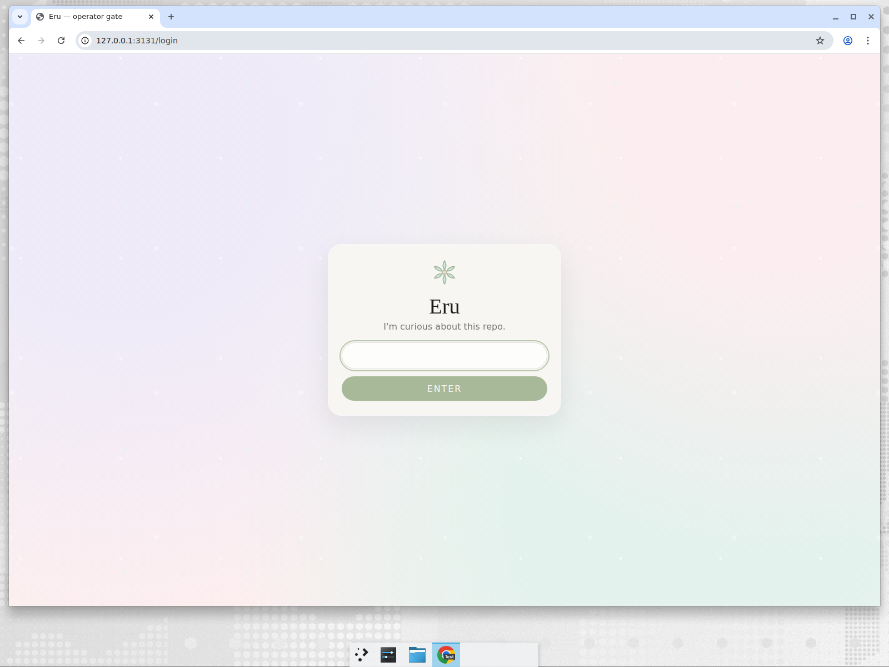
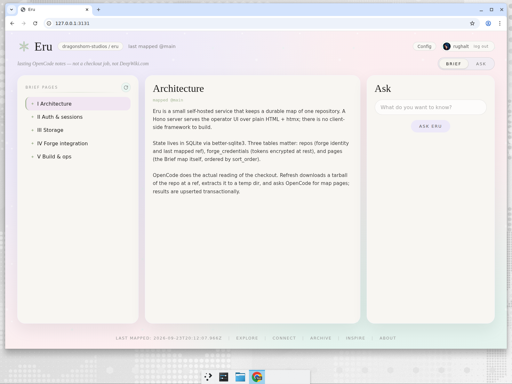
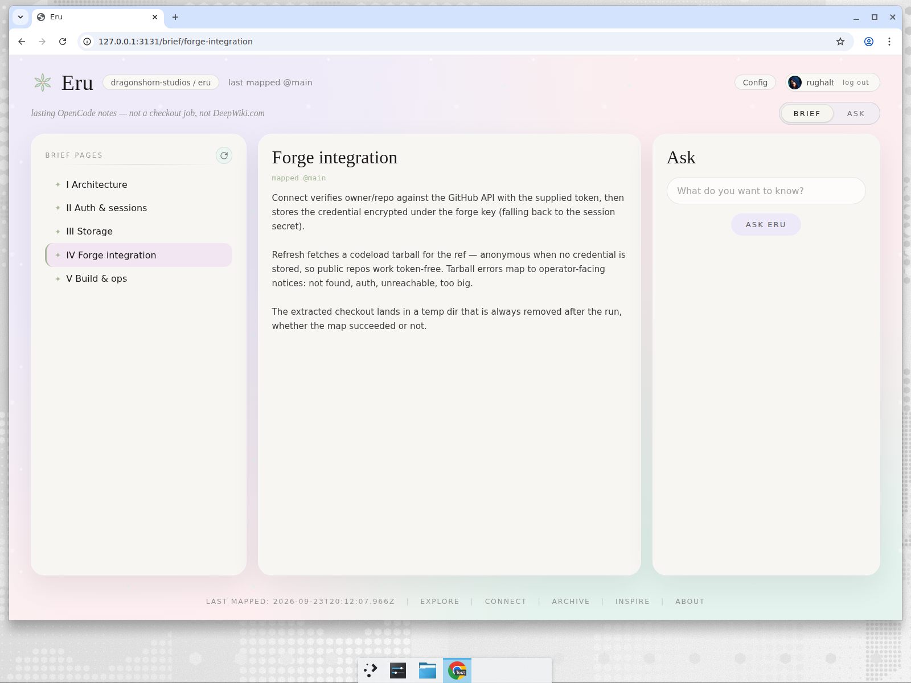
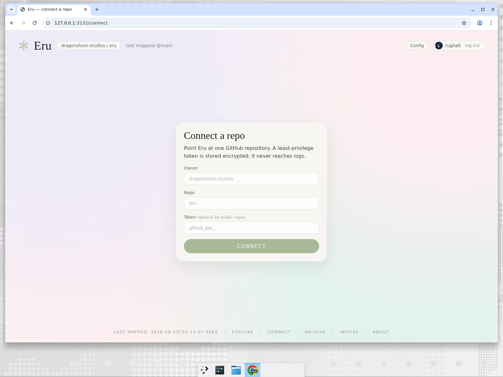
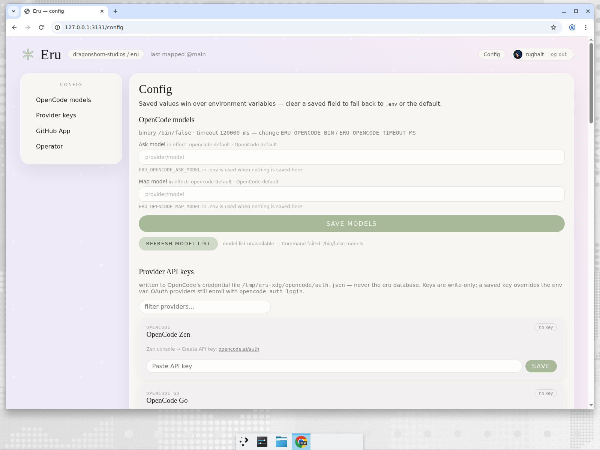

# The operator UI

Server-rendered HTML + HTMX, locked pastel tokens (cream, lavender, pink, mint, moss, rose), serif titles, sans body, mono paths. Every page except `/health` and `/login` sits behind the operator session cookie. `/ask` mounts the one exception: a React island (assistant-ui, bundled by esbuild into `dist/assets/ask.js`) inside the same shell — see The Ask tab.

## `/login`

The gate. Single password field (`ERU_UI_PASSWORD`), throttled, timing-safe compare, signed `HttpOnly` `SameSite=Lax` cookie. When `ERU_OAUTH_CLIENT_ID`/`SECRET` are configured, a **Sign in with GitHub** button appears (OAuth against a numeric-id allowlist, `ERU_OAUTH_ADMIN_IDS`); the password form then only shows with `ERU_UI_LOCAL_LOGIN=true`.

## `/` — Brief

The home view. Top bar: Eru seal, the active repo (`owner / name`), `last mapped @ref`, a refresh icon button (re-maps the default branch, with a progress view while it runs), the segmented **Brief / Ask** tabs, **Config**, and the operator pill (GitHub avatar when `ERU_UI_USER` or the Operator setting names a login). Left column is the page table of contents; the right column renders the selected page.

With no repo connected, the empty state points at `/connect`. With a repo that has no pages yet, it points at the refresh button.

## `/brief/<slug>`

One map page from SQLite — title, body, and its spot in the TOC. Bodies are model-written markdown rendered to escaped HTML; they cite source paths from the map.

## The Ask tab

Same shell, tab switched — but the stage is a full-page assistant-ui thread. A left rail lists that repo's threads (**+ New thread**, delete, `stale map` badge when the map moved past the snapshot the thread was built from); the main column is the streaming conversation with a composer (Enter sends, **Stop** cancels, failed turns keep a **retry** action).

Under the hood each thread owns an isolated workspace under `ERU_ASK_WORKDIR` (default `<sqlite dir>/ask`): a `map/<slug>.md` snapshot of the durable map plus a deny-by-default `opencode.json` (read/glob/grep only — no bash, no edits, no checkout). The browser never talks to OpenCode directly: the island calls same-origin `/ask/oc/<threadId>/*`, and Eru's proxy injects the loopback basic-auth and workspace `directory=` server-side, allowlisting only the endpoints the adapter uses (session, event stream, permission/question replies).

Threads persist across reloads — the OpenCode session id is recorded on the thread row and the conversation resumes where it left off. Answers render as markdown with map citations (`map/<slug>.md`) rewritten to `/brief/<slug>` links; citations to pages that do not exist stay plain text. Model output is never trusted as HTML.

## `/connect`

Point Eru at a GitHub repository two ways: pick from the connected GitHub App installation's repo list, **or** add one manually with owner/repo and an optional token (stored encrypted; optional for public repos).

## `/config`

Brief-style layout — sticky section nav on the left (OpenCode models / Provider keys / GitHub App / Operator), wide settings card on the right. Saved values win over env vars; every overridden field is marked `overrides ERU_*`.

- **OpenCode models** — separate Ask and Map model fields (`provider/model`), a datalist fed by `opencode models`, a refresh-list button.
- **Provider API keys** — write-only inputs per provider (OpenCode Zen, OpenCode Go, Anthropic, OpenAI, …), stored in OpenCode's `auth.json`, shown as a source badge plus a last-4 fingerprint.
- **GitHub App** — App ID, installation ID (auto-detect), private key (write-only, encrypted).
- **Operator** — the GitHub login shown in the top-bar pill and used for the avatar.

## Chrome conventions

- `last mapped @ref` is shown in the top bar on every page after the first successful refresh.
- During refresh the whole stage swaps to the mapping view — rotating voice lines and a progress bar — and swaps back when the map lands.
- The footer holds the last-mapped timestamp and the Explore / Connect / Archive / Inspire / About links.
